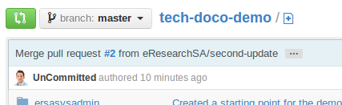
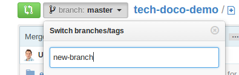

# Information relating to updating the documentation system.

## Editting a document

### Creating a new branch

Before editting a document, you need to create a new branch to do your work in.

To to 

### Adding a new file

Once you have selected the appropriate branch, you can create a new file just by typing it's name in the path box at the top, including directories that you want to create:

